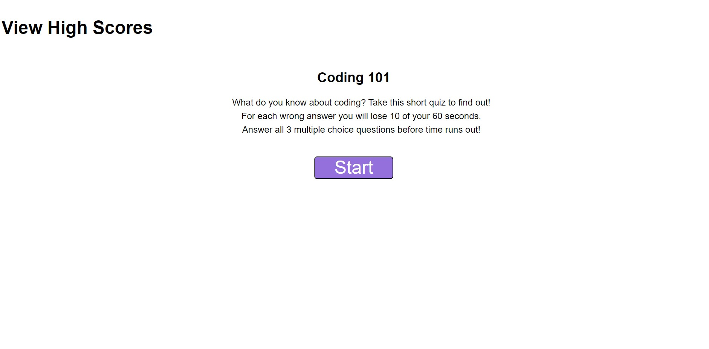

# coding-quiz

## Description

This is meant to be a coding quiz. It was built with HTML, CSS, and JavaScript.

It is meant to:

- present 3 multiple choice questions about coding
- subtract 10 seconds from the user's time if she answers the question incorrectly
- allow the user to enter his initials after the quiz is over and put that information into local storage

Through making the password generator I:

- gained an understanding of "callback" functions
- worked some more with timers, setInterval, and clearInterval
- learned to structure my code with variables at the top and functions after

I was unable to do many parts of this assignment.

With regards to JavaScript:

- "That's correct!" and "That's incorrect!" should disappear from the screen after each question
- the timer should stop after the user answers all the questions
- the initials input and save button at the end of the quiz do not work
- there is no local storage
- there is no way to "View High Scores"

As for CSS:

- "View High Scores" and timer at top of page are much larger than the mockup
- formatting should shift after "Coding 101" page so that questions and answers are on the left
- each multiple choice answer should have a purple box around it and white text
- after each answer there should be a gray line that pops up under the mutliple choice answers
- the "Save Button" at the end of the quiz looks crowded

---

## Installation

This coding quiz can be [viewed online](https://scott-j-clarke.github.io/coding-quiz/).

---

## Usage

This is extremely basic and poorly formatted.

---

## Credits

Thank you to Amber, Paige, and the rest of our study group for trying to help me with this assignment. 

---

## License

MIT

---

## Screenshot

---